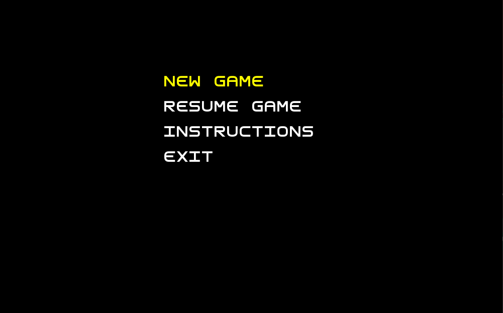
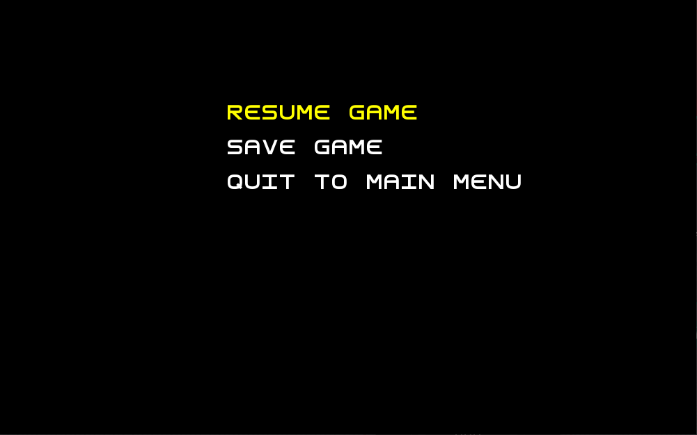
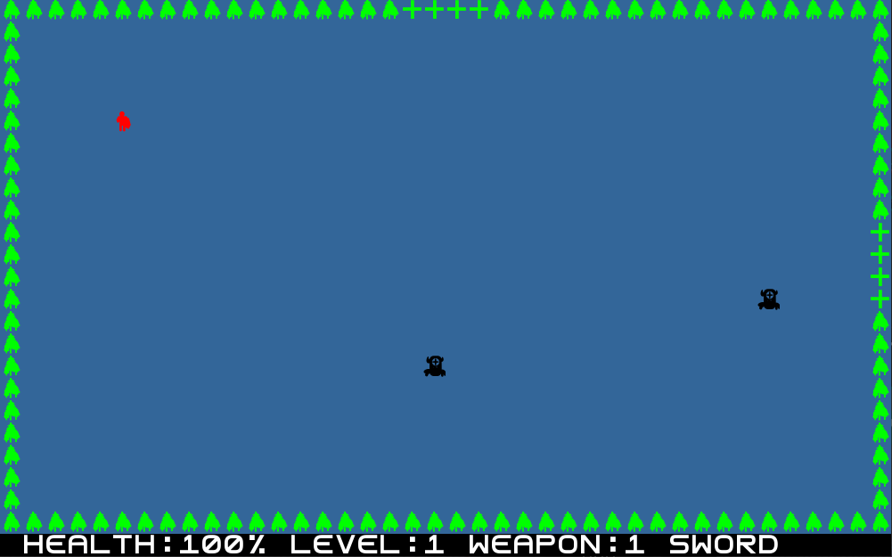
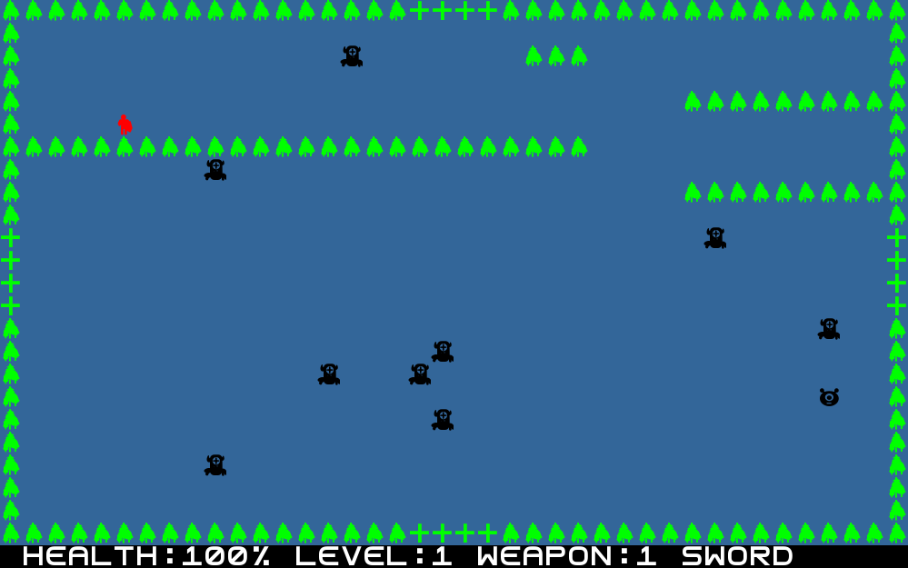

# LDTS G0506 - Monster Killer

## Game Description

Monster Killer is a RPG where you have to kill monsters in order to level up, increasing your stats in the process, and proceed to the next stages.
Each stage is harder than the one preceded.

This project was developed by Alexandre Costa (up202005319@edu.fe.up.pt), Antonio Augusto (up202000705@edu.fe.up.pt) and Andre Soares (up202004161@edu.fe.up.pt) for LDTS 2021⁄22.

For a more detailed version of this description click [here](docs/README.md). 

## Screenshots

The following screenshots illustrate the general look of our game, as well as the divergent functionalities:

### Menus

### Levels

